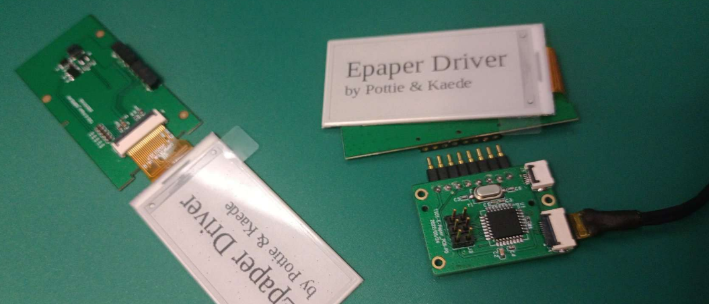
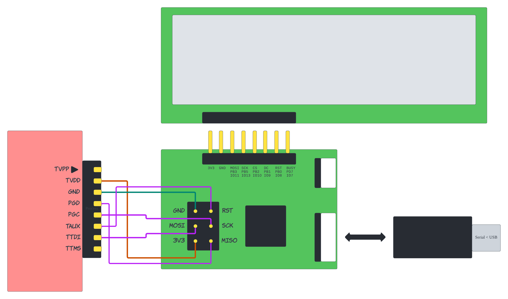

# ShineWorld 2.13in ePaper Driver for AVR MCU



## Quickstart (Ubuntu)

Install AVR-GCC toolchain and make Python virtual environment.

(For PicKit4 users: AVRDUDE of Ubuntu repository does not support PicKit4. In this case, install AVRDUDE manually. For installing the latest AVRDUDE, see [Using PicKit4 for AVR MCU programming in Arduino](doc/pickit4-arduino-avr.md).)

```
$ sudo apt install gcc-avr avrdude avr-libc
$ sudo apt install python3-pip
$ python3 -m venv devenv
(devenv) $ pip install -r scripts/requirements.txt
```

Compile and program

```
$ cd src
$ make
$ avrdude -c pickit4_isp -p m328p -U flash:w:main.hex
```

Transfer image data to MCU to display.

```
$ cd ..
$ python scripts/tlay2comm.py doc/example.png
```

## Motivation

While doing a ePaper (or E-Ink) related project, I found that there was no public driver library for [ShineWorld's epapers](https://shineworld.en.alibaba.com/productgrouplist-806500286/EPD.html).
As these Epaper displays were a way cheaper than other competitors, we wanted to use one of thir proudct, [SOPM021EB 2.13in ePaper](doc/datasheet-epd-sopm021eb.pdf).

I tried several common Epaper libraries, but none of them were able to display data on ShineWorld's 2.13in ePaper.
* [GxEPD](https://github.com/ZinggJM/GxEPD)
* [Adafruit EPD Library](https://github.com/adafruit/Adafruit_EPD)
* [SparkFun ePaper Library](https://github.com/sparkfun/SparkFun_ePaper_Arduino_Library)

The ePaper was using [UC8251](doc/datasheet-uc8251.pdf) as controller, and none of the above libraries have support for it.
I contacted the ShineWorld company and they provided an example code written for MSP430, which  had become the starting point of this project.


## Hardware

I got two custom made PCB.
* [ePaper adapter board](doc/sch-epaper-board.pdf), which is a copy of common ePaper driving adapters like [WaveShare E-Paper Driver HAT](https://www.waveshare.com/wiki/E-Paper_Driver_HAT).
* [MCU board](doc/sch-mcu-board.pdf), which is a copy of [Arduino UNO R3](doc/arduino-uno-r3.pdf). However, USB-UART chip is omitted and it is connected to external USB-UART adapter via FPC cable.

I connected [PicKit4](https://www.microchip.com/pickit4) and CH340 USB-UART adapter to the MCU board.



I had some issues on the first try using PicKit4 for programming.
I had to manually compile the recent version of [AVRDUDE](https://github.com/avrdudes/avrdude) and change ATmega328p's fuse bytes to use external 16MHz crystal just like on Arduino UNO.

For more details, I seperated this into another document [Using PicKit4 for AVR MCU programming in Arduino](doc/pickit4-arduino-avr.md)


## Limitations

Although I named this project as "ePaper Driver", this has only very basic feature.
The firmware just displays the image data received from UART.
It should have common functions like

* `print('c', x, y)`
* `printf("string")`
* ...

Any contribution will be appreciated.


## License

[The MIT License](https://opensource.org/licenses/MIT)
